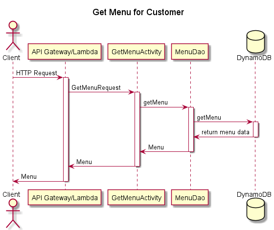

# Lucas and the Willies Design Document

## Instructions

*Save a copy of this template for your team in the same folder that contains
this template.*

*Replace italicized text (including this text!) with details of the design you
are proposing for your team project. (Your replacement text shouldn't be in
italics)*

*You should take a look at the example design document in the same folder as
this template for more guidance on the types of information to capture, and the
level of detail to aim for.*

## *Juicy Burger Online Ordering* Design

## 1. Problem Statement

[comment]: <> (*Explain clearly what problem you are trying to solve.*)
Here at Juicy Burgers, we've served our community for years. But the landscape is changing, and we're going
to change with it. We've decided to expand our business by adding an online presence that allows our customers 
to order food. The services will include online ordering capabilites available for pickup at the restaurant.

## 2. Top Questions to Resolve in Review

*List the most important questions you have about your design, or things that
you are still debating internally that you might like help working through.*

1. Is the shopping cart handled by the Front End or the Back End?  
2. Will the menu initially be hard coded on the Front End or a call to the database?  
3.  

## 3. Use Cases

*This is where we work backwards from the customer and define what our customers
would like to do (and why). You may also include use cases for yourselves, or
for the organization providing the product to customers.*

U1. *As a Juciy Burger customer, I want to be able to view the menu when I go to the website*

U2. *As a Juicy Burger customer, I want to be able to add, update, and delete menu items in my shopping cart*
    
U3. *As a Juicy Burger customer, I want to be able to place an order*

## 4. Project Scope

*Clarify which parts of the problem you intend to solve. It helps reviewers know
what questions to ask to make sure you are solving for what you say and stops
discussions from getting sidetracked by aspects you do not intend to handle in
your design.*

### 4.1. In Scope

- View the Juicy Burger menu
- Add menu items to a shopping cart
- Update items in a shopping cart
- Delete items from a shopping cart
- Place an order

### 4.2. Out of Scope

- Substitions on menu items
- Creating a user account
- Delivery service
- Order History

# 5. Proposed Architecture Overview

*Describe broadly how you are proposing to solve for the requirements you
described in Section 2.*

1) View the Juicy Burger menu
   The front end Javascript will either have a get request to the database for a menu (list of MenuItems) or it will have
   a menu pre coded into it. It will display the menu to the customer.
2) Add menu items to a shopping cart 
    The front end will have a put request to the Cart database with a MenuItem
3) Update items in a shopping cart
    The frontend will have an update request to the Cart database with a key for the MenuItem it's updating and an 
    updated MenuItem
4) Delete items from a shopping cart
    The frontend will have a delete request to the Cart database with a key for the MenuItem it's deleting
5) Place an order
    The frontend sends a get request to the cart database for the Order and sends it to startOrder()? Also, possibly
    creates a copy and sends it to the customer. 
 

*This may include class diagram(s) showing what components you are planning to
build.*

*You should argue why this architecture (organization of components) is
reasonable. That is, why it represents a good data flow and a good separation of
concerns. Where applicable, argue why this architecture satisfies the stated
requirements.*

This model represents a solution for every use case we proposed. Each function is constrained to a specific task, and
no function's use overlaps another. 

It's reasonable because we all talked about it and we're super duper reasonable people. 

# 6. API

## 6.1. Public Models

*Define the data models your service will expose in its responses via your
*`-Model`* package. These will be equivalent to the *`PlaylistModel`* and
*`SongModel`* from the Unit 3 project.*

Hamburger

ChickenWings

FrenchFries

PotatoChips

Coke

Water

Order

Cart

## 6.2. *First Endpoint*

*Describe the behavior of the first endpoint you will build into your service
API. This should include what data it requires, what data it returns, and how it
will handle any known failure cases. You should also include a sequence diagram
showing how a user interaction goes from user to website to service to database,
and back. This first endpoint can serve as a template for subsequent endpoints.
(If there is a significant difference on a subsequent endpoint, review that with
your team before building it!)*

*(You should have a separate section for each of the endpoints you are expecting
to build...)*

## 6.3 *Second Endpoint*

*(repeat, but you can use shorthand here, indicating what is different, likely
primarily the data in/out and error conditions. If the sequence diagram is
nearly identical, you can say in a few words how it is the same/different from
the first endpoint)*

## 6.4 *Third Endpoint*

# 7. Tables

*Define the DynamoDB tables you will need for the data your service will use. It
may be helpful to first think of what objects your service will need, then
translate that to a table structure, like with the *`Playlist` POJO* versus the
`playlists` table in the Unit 3 project.*

MenuTable - holds menu items

OrderTable - holds order items

# 8. Pages

*Include mock-ups of the web pages you expect to build. These can be as
sophisticated as mockups/wireframes using drawing software, or as simple as
hand-drawn pictures that represent the key customer-facing components of the
pages. It should be clear what the interactions will be on the page, especially
where customers enter and submit data. You may want to accompany the mockups
with some description of behaviors of the page (e.g. “When customer submits the
submit-dog-photo button, the customer is sent to the doggie detail page”)*
